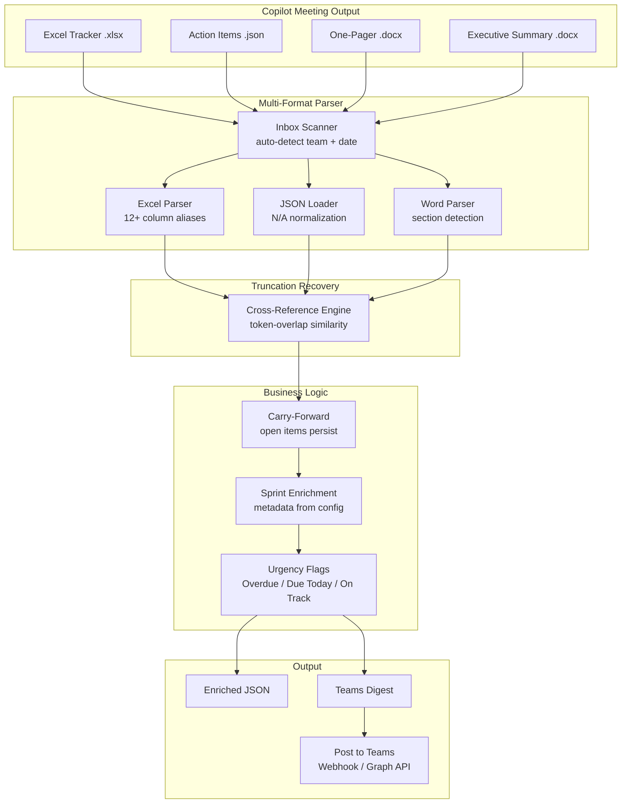
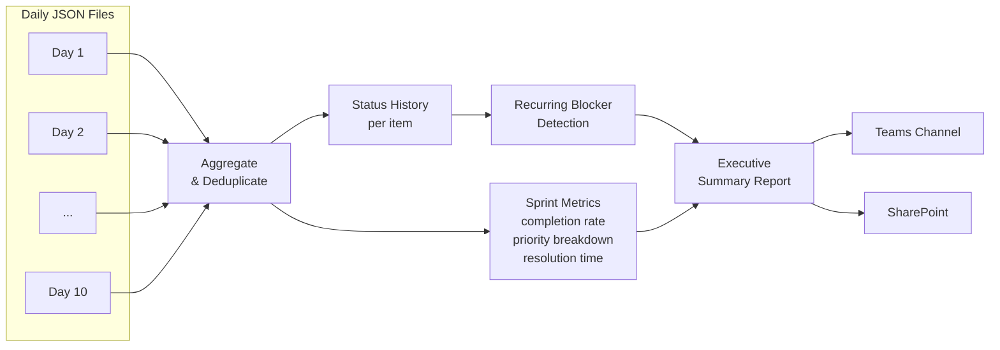
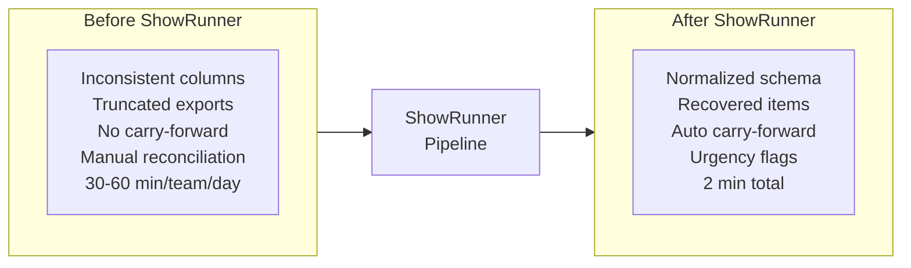
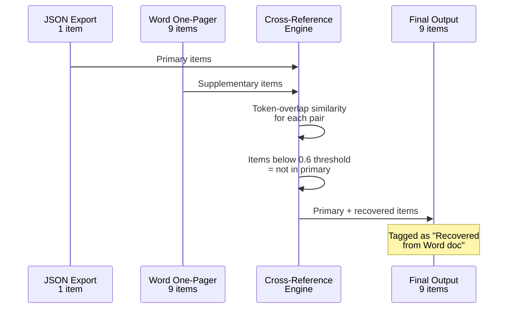

# ShowRunner

**Automated Stand-up Intelligence Platform** — Transforms daily stand-up meeting output into structured action tracking, daily team digests, and executive sprint reports.

Built with Python. Integrates with Microsoft Teams, SharePoint, and Microsoft Copilot.

> **Live Portfolio Site:** [samlee8868.github.io/Daily-Stand-up](https://samlee8868.github.io/Daily-Stand-up)

---

## The Problem

Engineering teams run daily stand-ups, and AI assistants like Microsoft Copilot generate meeting deliverables — but the output is **inconsistent** (column names vary), **incomplete** (files are silently truncated), and **scattered** across Excel, Word, and JSON formats. Project managers spend 30-60 minutes per team per day reconciling this into usable tracking. Nothing carries forward automatically. Executive reporting requires hours of manual aggregation.

## The Solution

ShowRunner is a single-command pipeline that:

1. **Parses** multiple input formats (Excel, Word, JSON) with intelligent schema mapping
2. **Recovers** truncated data by cross-referencing Word documents against structured exports using fuzzy matching
3. **Tracks** action items across days with automatic carry-forward and status change detection
4. **Categorizes** items by urgency (Overdue / Due Today / Blocked / New) with sprint health assessment
5. **Generates** a Teams-ready daily digest for each team
6. **Aggregates** sprint data into executive reports with completion metrics and recurring blocker analysis

---

## Architecture

### Daily Pipeline



### Sprint-End Flow



### Data Transformation



### How Cross-Referencing Works



---

## Key Features

| Feature | Description |
|---------|-------------|
| **Flexible Schema Mapping** | 12+ column name aliases per field handle inconsistent AI output |
| **Truncation Recovery** | Fuzzy cross-references Word docs to recover items dropped from exports |
| **Carry-Forward** | Open items automatically persist across days with change tracking |
| **Urgency Classification** | Overdue / Due Today / Due This Week / On Track — computed daily |
| **Sprint Health** | Green / Yellow / Red based on blocked and overdue item counts |
| **Multi-Team** | Config-driven team definitions — add new teams with zero code changes |
| **Teams Integration** | Adaptive Cards via Webhook or Graph API |
| **SharePoint Integration** | Graph API with MSAL client credentials for document management |
| **Prompt Engineering** | 260-line AI prompt spec with completeness verification and carry-forward rules |

---

## Sample Output

### Daily Teams Digest

```
Daily Stand-up Digest — Platforms — 2026-03-13
Sprint: Sprint 12 — Release 2.45 | Day 9 of 9

NEW ITEMS (4)
- Start work on Red Card after confirming priority — Owner: Jules — Priority: High
- Resolve merge conflicts across IMF/Niagara branches — Owner: Frank — Priority: High
- Review QA ticket 2389 spike — Owner: Bob — Priority: Medium
- Adjust parameters to fix thumbnail aliasing — Owner: Grace — Priority: Medium

Sprint Health: Green
```

### Enriched Action Item (JSON)

```json
{
  "Document Date": "2026-03-13",
  "Sprint": "Sprint 12 — Release 2.45",
  "Project Name": "Platforms",
  "Priority": "High",
  "Action Item Description": "Resolve merge conflicts across branches",
  "Owner (Full Name)": "Frank Okoro",
  "Delivery Status": "In Progress",
  "Urgency Flag": "On Track",
  "Change Since Last Stand-up": "New",
  "Dependencies / Blockers": "Multiple open MRs across repos",
  "Risk Level": "Medium",
  "Impact if Delayed": "Delays integration testing"
}
```

---

## Quick Start

### Prerequisites

- Python 3.9+
- Microsoft 365 account (for Teams/SharePoint integration)

### Setup

```bash
git clone https://github.com/SamLee8868/Daily-Stand-up.git
cd Daily-Stand-up

python3 -m venv venv
source venv/bin/activate
pip install -r requirements.txt

cp .env.example .env
# Edit .env with your Teams webhook URL and SharePoint credentials
```

### Configure

1. `config/teams.json` — Team definitions, members, meeting name variants
2. `config/sprints.json` — Sprint schedule with start/end dates
3. `config/settings.json` — Notification timing and preferences

### Run

```bash
# Process all stand-up files from inbox
python src/daily-flow/process_inbox.py \
  --inbox /path/to/inbox \
  --output-dir output/

# Post digest to Teams (dry-run)
python src/daily-flow/post_to_teams.py \
  --digest output/2026-03-13_PLAT_Teams_Digest.md \
  --team PLAT \
  --dry-run

# Generate sprint summary
python src/sprint-flow/aggregate_items.py --sprint 12 --team PLAT --data-dir output/
python src/sprint-flow/generate_summary.py --aggregate output/Sprint_12_PLAT_Aggregate.json --sprint 12 --team PLAT
```

---

## Project Structure

```
showrunner/
  config/              Team, sprint, and notification configuration
  docs/                Architecture and setup documentation
  prompts/             AI prompt specifications (v1 → v2.2)
  samples/             Reference data from team stand-ups
  src/
    daily-flow/        Inbox processing, parsing, digest generation, Teams posting
    sprint-flow/       Sprint aggregation, executive report generation
    utils/             SharePoint, Teams, and date utilities
  templates/           Jinja2 templates for reports and digests
```

## Tech Stack

| Component | Technology |
|-----------|-----------|
| Language | Python 3.9+ |
| Excel Parsing | openpyxl |
| Word Parsing | textutil (macOS) / python-docx |
| HTTP | requests |
| Auth | MSAL (Azure AD client credentials) |
| Config | JSON + python-dotenv |
| Portfolio Site | GitHub Pages (HTML/CSS/JS) |

## Documentation

- [Architecture](docs/architecture.md) — System design, data flow, integration points
- [Setup Guide](docs/setup-guide.md) — Detailed configuration and deployment instructions

---

## What Makes This Interesting

- **AI Output QA**: Detects and recovers from silent data truncation in AI-generated exports — a problem most teams don't even know they have
- **Prompt Engineering as Architecture**: The Copilot prompt (v2.2) is a 260-line formal specification with completeness verification, carry-forward rules, and cross-deliverable consistency — essentially an API contract with an AI system
- **Zero-Dependency Fuzzy Matching**: Cross-referencing uses token-overlap similarity with no external NLP libraries — just set intersection math
- **Config-Driven Scale**: Adding a new team is a JSON edit, not a code change

## License

MIT
